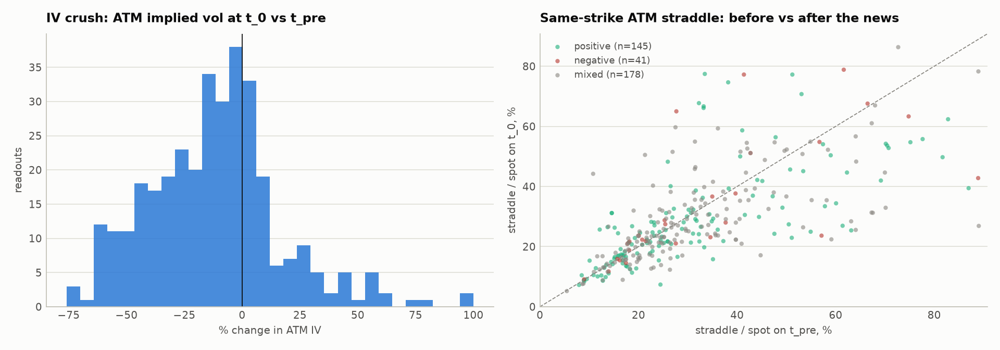

# 8-K event trading

Two strategies built on SEC Form 8-K filings and listed options, using Massive market data:

| | Strategy | Status |
|---|---|---|
| [`biotech-strategy-notebook.ipynb`](biotech-strategy-notebook.ipynb) | **Small-cap biotech trial results**: an LLM reads clinical-trial 8-Ks; trade the stock with an option hedge | Main study; write-up in [`WRITEUP.pdf`](WRITEUP.pdf) |
| [`facility_disruption/`](facility_disruption/) | **Facility disruptions vs. satellite data**: check plant-fire 8-Ks against NASA FIRMS heat data and sell overpriced event volatility | Exploratory |

## Small-cap biotech trial results

A small-cap biotech is usually one or two drug programs, so a clinical readout re-prices the whole company,
and the 8-K (Item 7.01/8.01 with the press release as EX-99.1) is where it is formally disclosed. Jev
(TypeSafe's language model, pinned to `jev-1.13.0`) reads each filing and scores the readout; the strategy
buys the stock with a protective put after a positive readout (or shorts it with a long call after a negative
one) when the day-0 move falls short of what the text implies.

**Result.** Jev reads the readouts well: its sentiment lines up with the day-0 move monotonically and
strongly. But by the close of the 8-K session the move is done, and the under-reaction rule shows no edge
over placebo at any horizon, in-sample (2024–2025) or out-of-sample (2026-01 → 2026-08). The option side of
the thesis does hold: implied volatility collapses once the result is out, so protection is far cheaper after
the event than before, and it cuts the worst decile of the long book roughly in half.

| | |
|---|---|
|  |  |

### Run it as is

1. `./setup.sh` (Windows: `powershell -ExecutionPolicy Bypass -File setup.ps1`). Creates `.venv`,
   installs `requirements.txt`, registers the kernel "Python (8k_event_trading .venv)", creates `.env`.
2. Put your Massive key in `.env`: `MASSIVE_API_KEY=...`
3. Open the notebook, pick that kernel, run all cells.

No Jev API access is needed: every Jev answer for the in-sample (2024–2025) and out-of-sample (2026-01..08)
filings is committed in `jev_cache/`.

### Run it on a new time window

A new window contains filings that are not in `jev_cache/`, so the notebook labels them live with Jev. For
that it needs a TypeSafe key in the same `.env` file:

    MASSIVE_API_KEY=...
    TYPESAFE_API_KEY=...

Then, in section 2 (Configuration), set

    HOLDOUT_START, HOLDOUT_END = "<start>", "<end>"
    RUN_HOLDOUT = True

and run all cells. Section 16 runs the entire chain on that window through `run_study(start, end)`:
events → EDGAR text → Jev → stock and option data → signal → P&L, with every parameter fitted in-sample and
frozen, and prints the same read-out as the out-of-sample section next to the in-sample result. The model is
pinned, so live labels are on the same scale as the cached ones. If the key is missing, the notebook stops at
the first uncached filing with a message saying so.

### Files

| File | What it is |
|---|---|
| `biotech-strategy-notebook.ipynb` | The full study, from events to P&L, with saved outputs |
| `WRITEUP.pdf` | Two-page write-up: hypothesis, method, results, failure modes, how to trade it |
| `biotech_universe.csv` | Every SIC 2834/2836 filer by CIK (1,499 names, including acquired, delisted and bankrupt) |
| `hand_labels.csv` | Hand labels used to validate the Jev classifier |
| `jev_cache/` | Committed Jev answers, keyed by a hash of (model, filing, questions) |
| `figures/` | Figures written by the notebook |

## Facility disruptions vs. satellite data

**Thesis.** Some 8-Ks disclose facility closures caused by outlier events such as fires, and the options
market often misprices how severe they are. Once such a filing is identified, NASA FIRMS satellite heat data
shows whether the fire was brief or persistent. On `brief` events the chain tends to price far larger moves
than the stock realises, so the trade sells that event volatility (cash-secured put, covered call, and an
iron-condor addendum).

[`facility_disruption/disruption-events-strategy-notebook.ipynb`](facility_disruption/disruption-events-strategy-notebook.ipynb)
runs from the cached event labels in `facility_disruption/disruption_events.json` with only a Massive key. It
does not yet generalise to arbitrary new windows, because refreshing the satellite labels for an arbitrary
period is hard; set `FIRMS_MAP_KEY` and `REFRESH_EVENTS = True` to re-pull them.
