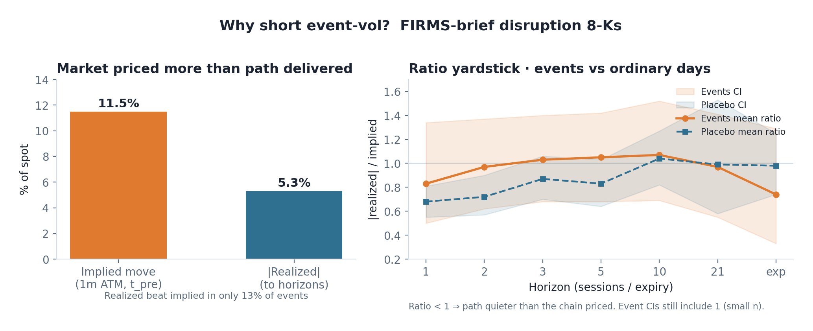
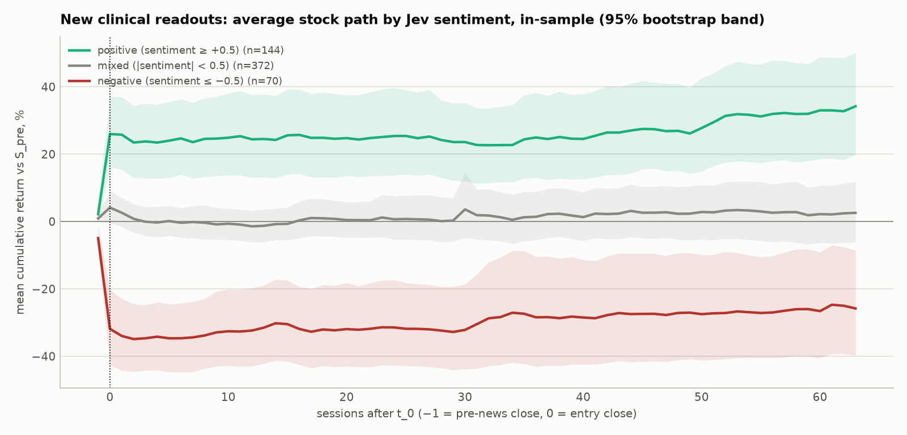
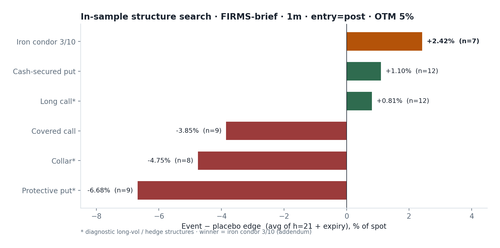
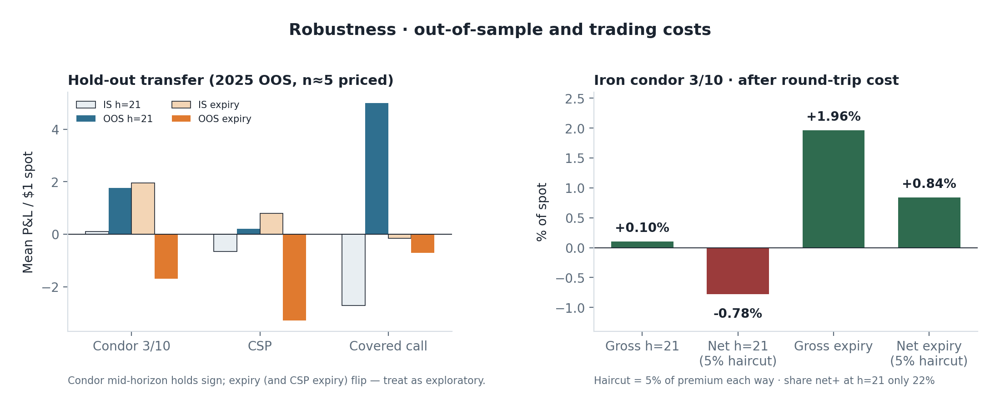
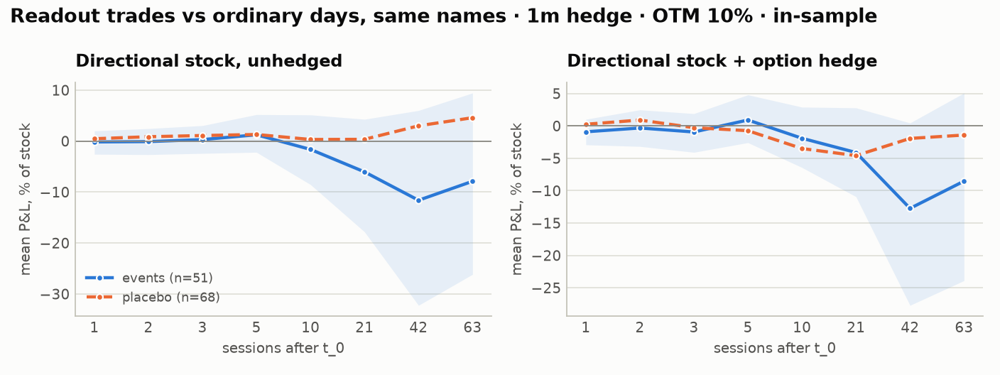

# Two 8-K event trades, one discipline: facility disruptions × FIRMS, and biotech readouts × Jev

*Gator Quant Hacks 2026 · Trade the 8-K · Strategy A: physical facility disruption 8-Ks screened by NASA FIRMS thermal persistence → defined-risk short event-vol (library 5 cash-secured put, extended to an iron condor). Strategy B: small-cap biotech `clinical_trial_results` 8-Ks graded by Jev → long/short stock with a protective put / call hedge (library 3 and 1). Both pre-registered; `run_study(start, end)` reproduces each on any window.*

<b>45 · 24 · 8</b>A: disruption 8-Ks · FIRMS-brief in-sample · out-of-sample

<b>11.5% → 5.3%</b>A: implied move vs |realized|; realized beat implied in 13%

<b>+2.42%</b>A: iron condor 3/10 edge over placebo (h=21 + expiry)

<b>1,140 / 333</b>B: readout 8-Ks, in-sample 2024–25 / out-of-sample 2026

<b>ρ = 0.38 · −23%</b>B: Jev vs day-0 move · put cost after the news vs before

## 1 · Hypothesis and novelty

Both strategies start from the same observation: an 8-K is a scheduled re-pricing, and the options chain states a price for it. The question is whether an **outside signal** says that price is wrong. The two signals, and the two sides of the trade, are different.

<b>A · Disruptions: the market over-prices what the satellite says is not burning.</b> A plant fire, outage or shutdown 8-K reads like a tail event, and the 1-month chain prices ~11% moves. NASA FIRMS gives an independent read of the site: if no thermal anomaly persists ≥ 3 days the filing is <code>brief</code>; if heat persists it is <code>persistent</code>. Claim: on <code>brief</code> filings realized paths are quiet, so sell premium with defined risk. The core five structures are stock-linked and cannot harvest a volatility edge; the iron condor can.

<b>B · Readouts: the text carries the signal, the market has it by the close, and the hedge is cheapest after.</b> A small-cap biotech is one or two programs, so a readout re-prices the company. Claims: (1) Jev can grade the masked press release on a five-level scale; (2) the market under-reacts by the entry close, so sign-following drifts; (3) implied vol collapses once the result is out, so the protective leg is cheaper after the news. Universe: all 1,499 SIC 2834/2836 filers, dead names included — big pharma filed zero such 8-Ks.

**Novelty.** Neither signal is in the price feed: one is a satellite label, the other a language model reading the filing. Neither trade is a generic long call — A is short vol with wings, B is a hedged directional book whose hedge timing is itself the finding.

## 2 · Method

| | **A · Disruptions × FIRMS** | **B · Readouts × Jev** |
|---|---|---|
| **Events** | Massive 8-K `items_text` → disruption phrases (fire, explosion, outage, shutdown, weather, force majeure) → geocode → FIRMS → `brief` / `persistent` / `unknown`. Trade `brief`; `persistent` is the control, `unknown` skipped. 55-name industrials / materials / energy universe. | One per accession, filer matched on CIK. EDGAR acceptance minute sets `t_0`, the first session at whose close the 8-K was public. Jev's announcement date sets the news session; `t_pre` is the session before, so the implied move is pre-news. |
| **Signal** | FIRMS persistence (`PERSIST_DAYS = 3`) on the geocoded site, applied to every disruption filing. | Nine typed questions per filing, company and drug codes masked: new readout, five-level outcome → `sentiment`, endpoint met, safety, phase, partner. |
| **Trade** | 1m chain, entry at the filing close, 5% OTM wings; synthetic spot from the ATM pair; six structures scored, iron condor 3/10 added. | `expected = 0.78 × sentiment × IM`; trade when P(readout) ≥ 0.7, \|sentiment\| ≥ 0.5 and `r0` is short of half the expected move. 10%-OTM, 21–45-day hedge. |
| **Controls** | Fixed horizons 1…21 + expiry; placebo ordinary days on the same names; bootstrap CIs on the difference; 2025 out-of-sample; 5% premium haircut; sensitivity on OTM, bucket, entry session, `PERSIST_DAYS`. | Placebo (same names, random sessions, random direction); sign-shuffle; no-Jev momentum baseline; stale readouts; 2026 out-of-sample frozen; 95% bootstrap; 28 × 8 sensitivity grid. |

<figure><figcaption><b>Fig. 1 · A, the yardstick.</b> Median 1m implied move vs realized on FIRMS-brief filings, and the |realized| / implied ratio by horizon against placebo days with bootstrap bands. Below 1 means the chain priced more than the path delivered.</figcaption></figure>
<figure><figcaption><b>Fig. 2 · B, the signal.</b> Cumulative return from the pre-news close by Jev sentiment, 586 new readouts, 95% bands. The separation is complete at the entry close: the text is right, and it is priced within the session.</figcaption></figure>

## 3 · Results, with uncertainty

<b>A · Edge in the premium.</b> Realized beat implied in 13% of events. Ranked on h=21 + expiry against placebo, <b>iron condor 3/10 +2.42%</b> (n = 7) &gt; cash-secured put +1.10% (n = 12) &gt; long call +0.81%; covered call −3.85%, collar −4.75%, protective put −6.68%. The condor difference from placebo excludes zero at h=10 (+0.82%) and expiry (+3.20%); the put and collar losses at h=21 also clear the CI. Event ratio CIs still include 1 — the edge is in the P&amp;L of the right structure, not in a single ratio.

<b>Out-of-sample 2025</b> (n ≈ 5 priced): the condor keeps its sign mid-horizon (+0.10% → +1.76% at h=21); hold-to-expiry flips (+1.96% → −1.69%), as does the cash-secured put. After a 5% premium haircut each way the condor is −0.78% net at h=21 and +0.84% net at expiry, with 22% of events net positive at h=21.

<b>B · Edge in the classifier and in the hedge, not in the drift.</b> Claim 1 held everywhere: Spearman 0.38 with the day-0 move (n = 586); 0.75 against 60 blind hand labels, 98% within one level; slope of <code>r0</code> on sentiment 0.41 micro-cap vs 0.16 mid+; biotech median |<code>r0</code>| 14% vs 1.5% for the big-pharma partner. Claim 2 failed: rule minus placebo at 5 sessions −1.1% in-sample, −4.0% out (CI excludes zero at h=1–5 out-of-sample); random directions beat the rule 77% / 94% of the time; no gate, size, entry or horizon in the grid turns it positive. Claim 3 held: ATM IV median 117% → 100%; a 10%-OTM put costs 8.6% of spot the evening before and 6.3% after (cheaper in 75% of readouts, median −23%). Realized / pre-news straddle median 0.6 at one session, 0.8 at 21.

<figure><figcaption><b>Fig. 3 · A, what wins.</b> Event-minus-placebo edge by structure, FIRMS-brief, 1m, entry = post, 5% OTM. Short defined-risk premium leads; stock-linked and long-vol structures lose.</figcaption></figure>
<figure><figcaption><b>Fig. 4 · B, the hedge is cheaper after.</b> Change in ATM implied vol from <code>t_pre</code> to <code>t_0</code>, and the same-strike straddle as a share of spot before vs after the readout; points below the diagonal are cheaper hedges.</figcaption></figure>

## 4 · Sealed-window prediction, on record

- **A.** The implied-vs-realized gap on `brief` filings replicates; the mid-horizon condor edge holds weakly or not at all at single-digit *n*; the **expiry** result flips sign again. Any filing the satellite mislabels — a `persistent` shock read as `brief` — hurts, with loss bounded by the wings.
- **B.** No edge over placebo at any horizon for the directional rule. The day-0 correlation, the size dose-response and the post-event IV drop replicate.
- Both pipelines take `(start, end)` and nothing else; event caches, classifier version and all fitted constants are frozen.

<figure><figcaption><b>Fig. 5 · A, out-of-sample and costs.</b> In-sample vs 2025 means at h=21 and expiry for the condor, cash-secured put and covered call, and the condor's gross vs net P&amp;L after a 5% premium haircut each way. The mid-horizon sign survives; expiry does not.</figcaption></figure>
<figure><figcaption><b>Fig. 6 · B, the directional book vs ordinary days.</b> Mean P&amp;L of readout trades, unhedged and hedged, against placebo sessions on the same names with 95% bands. Nothing separates from placebo before the hedge expires — the prediction we carry into the sealed window.</figcaption></figure>

## 5 · Trade realism

<b>A.</b> Enter at the filing-session close once the FIRMS label is available; 1m, 5% OTM wings, exit by h=10–21 rather than hold to expiry. Single-name OTM volume is thin (median 21 contracts on the legs) and the 5% haircut erases the h=21 edge, so size is small and the expiry leg is where the net edge survives. Skip <code>persistent</code> and <code>unknown</code>.

<b>B.</b> Not as a directional 8-K trade — median quoted spread 53% of mid turns +0.9% gross into −3.2% net, and hedge-leg volume caps a trade at about $548. What is usable: Jev as a same-day classifier (sign right 71% of the time on directional readouts) and the <b>post-event put</b> — hold the stock, buy the 10%-OTM 1-month put at the <code>t_0</code> close, cross the spread, size to the leg's volume.

<b>What a PM takes away.</b> Two independent outside signals, two different places the edge lives. On disruption 8-Ks the satellite says the chain is over-priced, and a defined-risk short-vol structure collects it mid-horizon before costs; on readout 8-Ks the model is right about direction, the market agrees within the session, and the edge is in paying less for the hedge after the print. Both are small-<i>n</i>, cost-sensitive, and stated with the horizon and the failure mode a desk would need.

