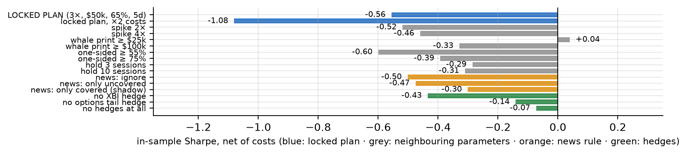
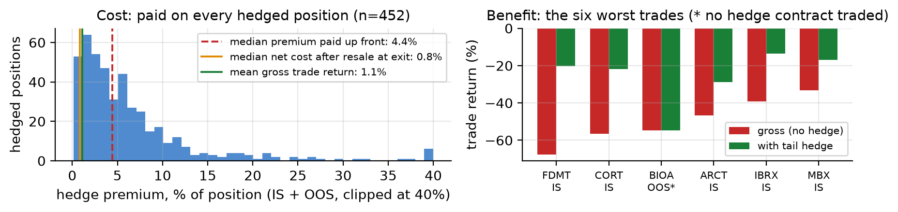
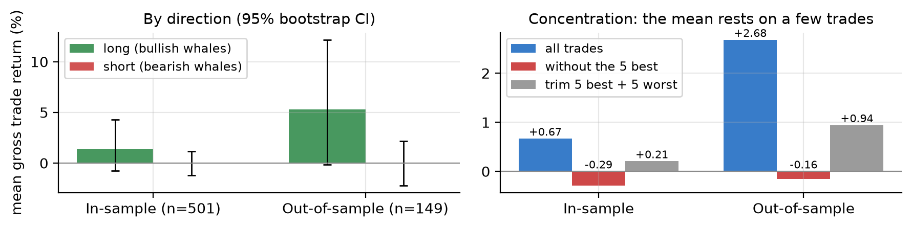
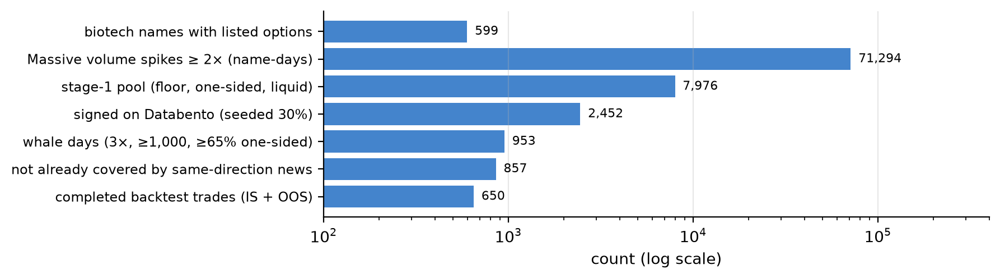
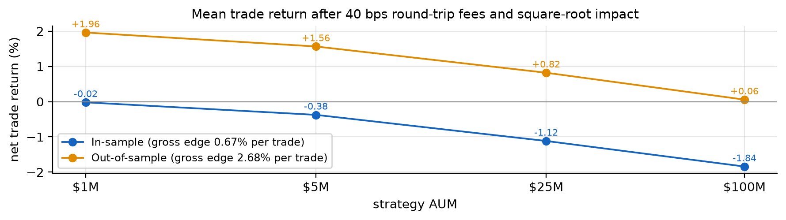

# Ghost Whales in Biotech Options

**Large one-sided option trades before the news: a pre-registered test, net of costs, with one locked out-of-sample run**

Gator Quant Hacks 2026 · Systematic Trading · Data: **Databento** (OPRA trades + quotes), **Massive** (option volume, news sentiment, option prices), **Webull** (stock/ETF bars) · Code: `tracks/whale_footprints/`; `python run_all.py --from-signals [--oos]` reproduces every number here. IS = in-sample, OOS = out-of-sample.

---

## Summary

Informed biotech traders (trial readouts, FDA decisions, takeovers) use options because they cannot buy the stock at size unseen, so large one-directional option trades ("whales") placed **before the news** should predict the next few sessions. We committed the rule, its parameters and a locked holdout before pulling any data (commit `16e75ab`, 2026-10-03 18:39 ET). **The pre-registered strategy fails:** net Sharpe is **−0.56 IS** (2024-01 to 2026-03) and **−0.76 OOS** (2026-03 to 2026-10, run once). The signal underneath is positive but not significant: +1.06% IS and +2.54% OOS per whale day over 5 sessions, and both 95% intervals include zero. Post-hoc diagnostics show why: (i) the **options tail hedge** costs more than the edge; (ii) **all of the edge is on the long side**; (iii) the mean rests on **a handful of outlier trades**. The hedge-free variants (OOS Sharpe +0.70 and +1.46) were declared before the holdout, but adopting them after seeing it would be tuning on the test set, so **we report them and do not adopt them**. In total we ran **23 backtests** (16 IS, 7 OOS), all in `results/variants_log.csv`.

## 1 · Economic hypothesis

**Who is on the other side.** (a) *Option market makers* who sell the calls and puts. They delta-hedge, so their hedging pushes the stock **the same way** as the informed trade [Ni et al. 2021]. They earn the spread and don't take a view on direction. (b) *Holders and short-sellers who haven't seen the information yet*, mostly retail and slow institutional money that reacts to headlines rather than option prints.

**Why it should exist and persist.** Biotech value turns on binary events that insiders, advisers and trial-site staff know about before disclosure. Trading the stock directly is illegal, visible or both, while options offer leverage and cover. Option volume leads stock prices [Easley, O'Hara & Srinivas 1998; Pan & Poteshman 2006], informed option buying spikes before takeovers [Augustin, Brenner & Subrahmanyam 2019], and oncology stocks drift before trial news [Rothenstein et al. 2011]. Option flow is hard for the public to read in real time, and information diffuses slowly [Hong & Stein 1999]. Enforcement is sporadic, and competing flow-watchers limit capacity rather than remove the edge.

**What is new.** Pan & Poteshman needed proprietary CBOE open-buy data. We **sign each print against the consolidated bid/offer at the moment it traded**, using public OPRA data (Databento `tcbbo`). We **condition on whether the news already carries same-direction sentiment**, which tests private information directly against public reaction. And we **price a real options tail hedge** on actual option trades, in the sector where overnight gaps make a stop-loss unreliable.

**Pre-registered predictions.** P1: uncovered whale days earn a positive direction-signed 5-session return, net of costs, both IS and OOS. P2: news-covered days earn about zero, so the filter adds value. P3: the edge rises across whale-premium terciles. P4: the edge fades by 10–20 sessions. **It fails if** P1 is not positive OOS, neighbouring parameters flip the sign, XBI beta explains the returns, or the edge dies at double costs.

## 2 · Data and universe

**Roles, one per vendor.** *Massive:* sampled daily option volume (the screen), per-ticker news sentiment (the filter), daily option bars (hedge prices) and split-adjusted stock bars (liquidity filter). *Databento:* OPRA `tcbbo` (every option trade with the bid/offer at print time), bought only for flagged days: 2,452 name-days for **$63.52**, each request priced with `metadata.get_cost` first. *Webull:* split-adjusted daily stock and XBI bars, **the only prices the backtest trades on** (backtrader).

**Universe and survivorship.** The team's biotech list has 1,061 symbols after mapping each company to one; 599 of them had listed options in the window. Dead and acquired names were kept. Webull no longer carries 29 names that generated signals (80 IS signals, many of them takeover targets). Priced on Massive bars, which keep delisted names, those signals' direction-signed 5-session return averaged **−0.79%** (OOS: 6 signals, −3.3%). Excluding them **flatters** the results slightly; it does not hide an edge. **Corporate actions:** bars are split-adjusted by the vendor, and dividends are immaterial for this universe. **Missing data:** never filled. No bar on the signal day means no trade (102 signals, 86 of them on those names), and a name that stops trading mid-hold is closed at its last close.

**Locked split.** History runs 2024-01-02 to 2026-10-02. OOS is the most recent 20% (shorter than two years): **2026-03-16 to 2026-10-02, 139 sessions**. It was run once, at 22:12 ET on 2026-10-03, after the IS results were committed (`3c468f6`); `results/OOS_LOCK.json` stores the run time and spec hash. The IS book takes no signal after 2026-03-13; its last position closed on 2026-03-23.

## 3 · Methodology

**Pipeline** (funnel in Appendix Fig. A1). (1) **Screen (Massive):** keep name-days where sampled option volume is at least 2× its 20-session median (71,294), then require a contract floor, a one-sided call/put share, price ≥ $3 and 20-day dollar volume ≥ $5M, all measured before day *t* (7,976 left). (2) **Sign (Databento):** for a **seeded 30% random sample** (2,452 days; seed 20261003, the same draw for IS and OOS), sign every print of at least $50k premium. At or above the ask counts as bought, at or below the bid as sold, and anything in between goes to the nearer side. Bullish premium = calls bought + puts sold. (3) **Whale day:** volume spike ≥ 3×, at least 1,000 contracts on the full tape, and at least 65% of whale premium on one side (953 days). (4) **News:** skip the day if any article from 3 days before *t* through the open of *t*+1 carries ticker sentiment that agrees with the whales (857 left). (5) **Trade:** enter at the **open of *t*+1**, after every input is known, and exit at the open 5 sessions later.

**Sizing, limits and hedges (pre-registered).** Weight = min(1% ÷ 20-day daily σ, 10%), capped at 2% of 20-day share volume, with at most 10 positions. Net stock exposure is hedged daily with XBI. A −15% close-to-entry loss exits at the next open. New sizes are halved while equity is more than 15% below its peak, and restored once it recovers. **Tail hedge:** a ~10% out-of-the-money put on each long (a call on each short), ~30 days to expiry, bought at that day's VWAP plus 5% of premium and sold when the stock leg exits. (Whole-day VWAP is an approximation that affects hedge cost only, not the signal or stock fills.)

**Costs.** **20 bps per side** on stock (half-spread plus slippage for small and mid-cap biotech), 2 bps on XBI, borrow at 5% a year on shorts (0.5% on the XBI short). A daily-bar spread estimate [Abdi & Ranaldo 2017] gave 67 bps full spread IS (≈ 33 bps half-spread) but was undefined OOS and not monotone in liquidity, too noisy to set costs with. So we treat 20 bps as optimistic and **report ×2 costs (40 bps per side) as the realistic case**.

**Trials.** Seven implementation changes were logged with reasons in `DEVIATIONS.md` before any result existed (budget-driven screening and sampling, the Webull host, the tail hedge). We ran 16 IS configurations: the baseline, ×2 costs, 8 neighbouring parameters, 3 news rules and 3 hedge settings (Fig. 3). OOS we ran the 7 configurations declared in advance, once, in a single sitting. The direction, concentration, attribution and survivorship analyses are **post-hoc diagnostics** (`note_stats.py`), not strategy changes.

## 4 · Results

| Net of costs | Ann. return | Vol | Sharpe | Max DD | Turnover | Worst month | Trades | Hit rate |
|---|---|---|---|---|---|---|---|---|
| **IS locked** | **−11.5%** | 18.8% | **−0.56** | −27.8% | 46×/yr | −7.7% | 501 | 50.7% |
| IS ×2 costs | −18.6% | 17.6% | −1.08 | −38.9% | 44×/yr | −7.2% | 501 | 50.7% |
| **OOS locked** | **−25.7%** | 32.3% | **−0.76** | −27.3% | 57×/yr | −10.0% | 149 | 51.7% |
| OOS ×2 costs | −31.3% | 30.2% | −1.09 | −30.1% | 54×/yr | −12.2% | 149 | 51.7% |

OOS's annualised −25.7% is a −15.1% total return over 139 sessions. Turnover = traded notional (stock, XBI and options) ÷ mean equity, per year.

*Figure 1: Locked plan, net of costs. IS by calendar year: 2024 −23.3% (Sharpe −1.32), 2025 +0.8% (+0.13), 2026 Q1 −1.8%.*

| Prediction | IS | OOS | Verdict |
|---|---|---|---|
| **P1** signal, 5 sessions, gross | +1.06% [−0.01, +2.32], n = 593 | +2.54% [−0.38, +5.98], n = 173 | Positive, not significant; **fails net** |
| **P2** news-covered days, 5 sessions | +3.90%, n = 68 (beats traded days) | −3.83%, n = 22 | **Sign flips: no evidence** |
| **P3** gross trade return by size tercile | +0.57 / +0.24 / +1.20% | −0.15 / +1.35 / +6.82% | **Mixed** (monotone OOS only) |
| **P4** fades by 10–20 sessions | +1.57% at 10 [+0.11, +3.20]; +1.41% at 20 | +2.40% at 10; +3.75% at 20 | **Fails: no fade** |

*Figure 2: Direction-signed return after whale days, with 95% bootstrap CIs. Blue: days we trade. Orange: days skipped because the news already agreed with the whales.*

**Robustness.** Every neighbouring parameter is also negative IS except whale prints ≥ $25k (+0.04): a plateau of failure, not a cliff around tuned values (Fig. 3). Beta doesn't explain the result: IS βXBI = 0.03 (t = 0.69), α = −10.5%/yr (t = −0.84), R² = 0.001. OOS shows a short-SPY tilt (β = −0.47, t = −2.03). The **Deflated Sharpe probability** [Bailey & López de Prado 2014] is 0.07 in both periods (16 and 7 trials): no evidence of skill.

*Figure 3: All 16 IS configurations, net of costs. This is the full trial set; nothing is omitted.*

## 5 · Where it breaks (post-hoc diagnostics)

**The hedge costs more than the edge.** The up-front premium was a median **4.4%** of position (90th percentile 14%), because biotech implied volatility is extreme before catalysts. Most is recovered when the option is resold at exit. The **realised net cost** averaged **0.85% per hedged trade IS and 2.27% OOS**. Weighted by position size, that is −0.54% and −1.70% per trade, against a gross edge of +0.40% and +1.44%, so the edge is gone before the 40 bps round-trip stock cost. Adding the hedges one at a time to the same trades, annual return moves from −3.6% (no hedges) to −4.7% (+XBI) to −11.5% (+options) IS, and from +50.8% to +18.8% to −25.7% OOS.

*Figure 4: The tail hedge's cost and benefit. Worst trade: FDMT −67.6% gross vs −20.2% hedged (−6.8% vs −2.0% of equity).*

**Only bullish whales carry information.** The mean gross trade return is **+1.39% IS and +5.28% OOS for longs**, and **+0.01% and −0.03% for shorts**, even though shorts are half the book and also pay borrow. This fits the hypothesis: insiders mostly trade positive private news (takeovers, positive readouts), while bearish prints include hedging. **The edge is concentrated:** the five best trades supply 142% (IS) and 106% (OOS) of gross P&L. Without them the mean trade is −0.29% and −0.16%; trimming the five best and five worst leaves +0.21% and +0.94%. OOS, the top two trades (KOD +200% and AVTX +71%, both longs) supply 101% of size-weighted gross P&L, so the unhedged OOS Sharpe of 1.46 is **not** evidence of a robust edge.

*Figure 5: Left: mean gross trade return by direction. Right: the mean with outliers removed.*

## 6 · Risk management

**Limits, set in advance, and how they behaved.** ≤ 10% of equity per name and ≤ 10 names, so gross stock exposure is at most 100% (realised median while invested: 25% IS, 30% OOS). Net stock exposure (range −80% to +64%) is hedged daily to about zero with XBI. **Worst single-name loss:** the stop exits at the next open, so it cannot stop an overnight gap. An unhedged 10% position that gaps −68% costs 6.8% of equity, which is exactly what FDMT did. The put caps the loss near (10% OTM + premium + spread) × weight, about 1.5–2% of equity (FDMT hedged: −2.0%). **De-risking (pre-set and symmetric):** sizes are halved below −15% from peak and restored on recovery. The rule was active in **77%** of sessions in both periods, so the book ran at half size for most of each test. The stop fired 18 times IS and 9 times OOS.

**Factor, tail and regime.** XBI beta is about zero, by construction and by regression (§4). In the tails the hedge did its job, cutting the five worst IS trades by 16–47 points. But **32% of IS entries and 27% of OOS entries went unhedged** because the chosen contract did not trade that day, and the worst OOS trade (BIOA −54.7%, −2.7% of equity) was one of them. IS losses are concentrated in 2024 (−23.3%); 2025 was flat.

**Changes we would make before trading live** (proposed, *not* backtested, so not results): go long-only, which drops the side with no edge along with its borrow and squeeze risk; hedge only when a known catalyst date falls inside the hold; apply a hard 5% name cap whenever no hedge contract trades; add a kill switch at −20% from peak until a fresh holdout passes.

## 7 · Liquidity and capacity

Each position is capped at 2% of 20-day share volume. Realised participation had a median of **0.10% of ADV** (95th percentile 0.5–0.7%, maximum 2.0%), and only names with at least $5M of daily dollar volume enter. **Impact model:** cost per side = k·σdaily·√(shares/ADV), with k = 1 [Almgren et al. 2005], applied to the actual trades scaled to larger books. The ADV cap starts to bind at $25M.

| AUM | Participation | Round-trip impact | Net trade, IS | Net trade, OOS | Capped trades, IS/OOS |
|---|---|---|---|---|---|
| $1M | 0.1% | 29–32 bps | **−0.02%** | **+1.96%** | 0 / 0 |
| $5M | 0.5% | 64–72 bps | −0.38% | +1.56% | 0 / 0 |
| $25M | 2.2–2.5% | 138–146 bps | −1.12% | +0.82% | 40 / 16 |
| $100M | 8.9–9.9% | 211–222 bps | −1.84% | +0.06% | 246 / 71 |

*Net trade = mean gross trade return − 40 bps round-trip fees − impact, before the tail hedge (Appendix Fig. A2).*

**Capacity.** On the IS edge it is **zero**: the trade is negative after impact even at $1M. On the larger OOS edge, half the edge is gone near $25M and all of it near $100M. We trust the IS figure more, because it has 3× the trades and depends less on two outliers. Our honest envelope is **under $5M**, for a long-only version that passes a new holdout. Further limits: the **hedge leg is less liquid than the stock leg** (27–32% of chosen contracts didn't trade on the entry day), and **borrow** on small-cap biotech can far exceed the 5% we assumed, another reason to drop the shorts.

## 8 · Limitations and next steps

**What failed, ranked by cost.** (1) The **tail hedge**: the right instinct but the wrong instrument, because insuring every trade in a high-implied-vol name wipes out a ~1% edge. (2) **Shorts**: no edge in either period. (3) **The news filter** (P2): its sign flips between samples, and with sparse small-cap coverage we can't tell "no news" from "no news we can see". (4) **The 5-session hold** (P4): the drift hasn't faded by day 10. (5) **The sample**: the budget limited us to a 30% Databento sample, and the 139 OOS sessions cover one regime; intervals are wide and a few trades drive each period's mean. **What could break even a repaired version:** faster dissemination of option flow or tighter enforcement (the edge gets arbitraged away); a regime like 2024; and option liquidity or borrow vanishing exactly when it is needed.

**Next steps, with a fresh holdout.** Pre-register a **long-only, catalyst-conditional-hedge, 10-session** version. The data above informed each choice, so test it on data after today or on the 70% of the stage-1 pool we never signed (signing it triples *n*). Use timestamped headlines instead of a sentiment flag, and measure stock spreads from quotes.

**Bottom line.** We pre-registered a hypothesis, tested it net of costs on a holdout we ran once, and it failed. A positive but fragile long-side signal survives. We report the attractive hedge-free numbers without adopting them, because adopting them would use up the only test set we had.

---

## References (outside the page limit)

Abdi, F. & Ranaldo, A. (2017). A simple estimation of bid-ask spreads from daily close, high, and low prices. *Review of Financial Studies* 30(12). · Almgren, R., Thum, C., Hauptmann, E. & Li, H. (2005). Direct estimation of equity market impact. *Risk* 18(7). · Augustin, P., Brenner, M. & Subrahmanyam, M. (2019). Informed options trading prior to takeover announcements: insider trading? *Management Science* 65(12). · Bailey, D. & López de Prado, M. (2014). The deflated Sharpe ratio. *Journal of Portfolio Management* 40(5). · Easley, D., O'Hara, M. & Srinivas, P. (1998). Option volume and stock prices: evidence on where informed traders trade. *Journal of Finance* 53(2). · Harvey, C., Liu, Y. & Zhu, H. (2016). …and the cross-section of expected returns. *Review of Financial Studies* 29(1). · Hong, H. & Stein, J. (1999). A unified theory of underreaction, momentum trading, and overreaction. *Journal of Finance* 54(6). · Ni, S., Pearson, N., Poteshman, A. & White, J. (2021). Does option trading have a pervasive impact on underlying stock prices? *Review of Financial Studies* 34(4). · Pan, J. & Poteshman, A. (2006). The information in option volume for future stock prices. *Review of Financial Studies* 19(3). · Rothenstein, J., Tomlinson, G., Tannock, I. & Detsky, A. (2011). Company stock prices before and after public announcements related to oncology drugs. *Journal of the National Cancer Institute* 103(20). · Software: backtrader, pandas, numpy, scipy, matplotlib.

## Appendix (optional, outside the page limit)

**Reproduce.** `pip install -r requirements.txt` → API keys in `.env` (see `.env.example`) → `python run_all.py --from-signals` (IS), then `python run_all.py --from-signals --oos` (the locked run, same spec hash) → `python note_stats.py` → `python make_figures.py` → `uv run --no-project --with markdown python render_note.py`. The derived tables (`data/signals.csv`, `whale_days.csv`, `news.csv`) are committed, so Databento is not needed. Headline numbers are in `results/{is,oos}_metrics.csv`, `results/{is,oos}_summary.json` and `results/note_stats.json`.

*Figure A1: Signal funnel. Of the 857 tradeable signals, 650 became completed trades and 203 were skipped (102 had no Webull bar, 63 were names already held, 38 hit the position cap). The last 4 OOS signals fell in the final four sessions, too late for a 5-session hold.*

*Figure A2: Net mean trade return after fees and square-root impact, by AUM.*
