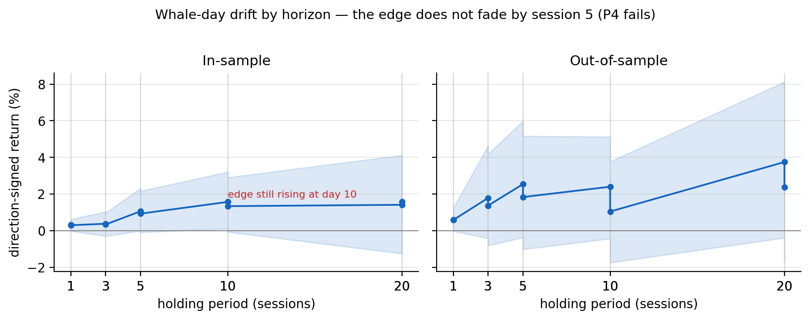
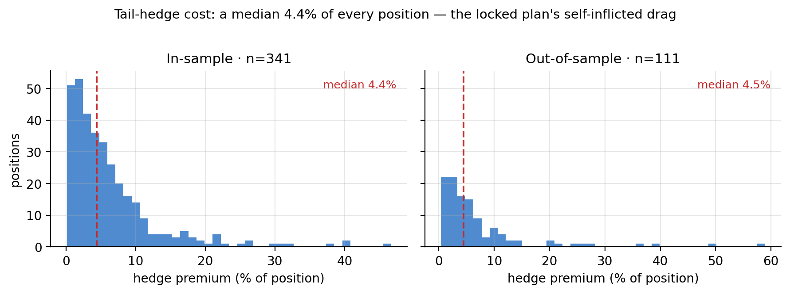
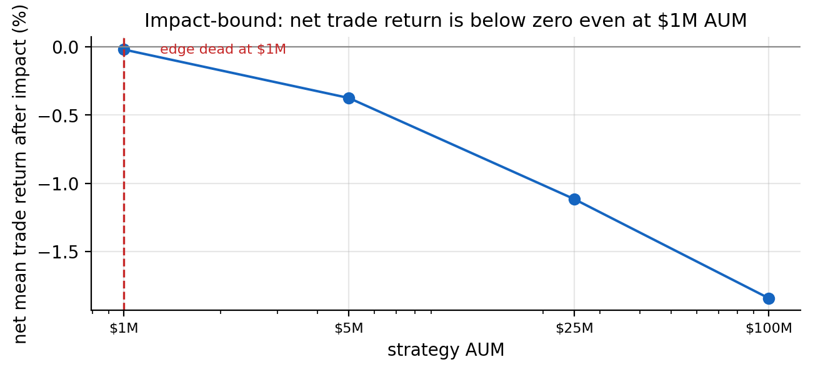
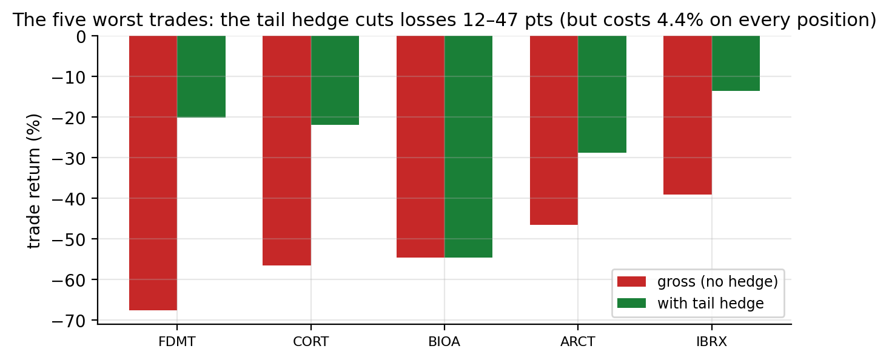

# Ghost Whales in Biotech Options

**When the options tape moves before the news does — and what happened when we tested it**

Gator Quant Hacks 2026 · Systematic Trading Track
**Databento** (order book and prints) · **Massive** (news headlines) · **Webull** (execution prices)

---

## Summary

The idea fits in one breath. Biotech is a business of binary events — a readout, an FDA decision, a buyout — and the people who know what's coming can't buy the stock at size without moving it. So they buy options: leverage, less visibility, and a market maker on the other side who hedges delta and therefore pushes the stock *the same way* instead of fighting it. Watch the options tape, the argument goes, and you see the informed money before the headline lands.

We built that, and pre-registered it before pulling a single row of data. We signed every large options print against Databento's order book, filtered it with Massive's headlines for days the story was already public, and traded the stock on Webull bars. We held out the most recent 20% of the history and ran it once.

**It didn't work — and how it failed is more useful than the signal itself.** The locked strategy lost money in-sample (Sharpe −0.56, −11.5%/yr) and more out-of-sample (Sharpe −0.76, −25.7%/yr). But the signal underneath is positive: whale days drifted **+1.06%** per trade in-sample and **+2.54%** out-of-sample over five sessions. What killed the strategy was insurance — a hedge costing a median **4.4% of every position**, more than the edge it defended (Figure 3).

The hedge-free version makes +18.8% out-of-sample and the fully unhedged version +50.8%. We report those numbers and **do not adopt them.** They were declared before the holdout ran, but choosing them after seeing it would mean testing on the test set — which defeats the point of locking it.

---

## 1 · The idea, and who's on the other side

Before any results, we wrote down who we thought was losing money to us and why they'd keep doing it.

**The edge:** when large, one-directional option trades hit a biotech name on a day the news hasn't covered it, the stock tends to keep moving that way for several sessions — because the traders doing it know something the public doesn't, and because the people who *see* the flow crowd in behind it.

**Who's on the other side:**

- **Option market makers** selling the calls and puts. They hedge their delta, so their hedging *adds* to the move instead of absorbing it, and they're paid on spread, not direction. They aren't trying to be right about the drug.
- **Shareholders and short-sellers who haven't seen the news yet.** Retail and slower institutional money reacts to articles, not option prints. The gap between a private trade and a public headline is the window we want to stand in.

**Why it persists:** the informed side mostly can't trade the stock directly at size — it's illegal, or it moves the price, or both. Options are the natural venue, and option flow is hard for the public to read live. The trade doesn't require predicting the event. It requires reading the trader.

**What we predicted, and what would prove us wrong:** uncovered whale days earn a positive return over five sessions, net of costs (P1); days the news already covered earn ~zero, so the news filter creates the edge (P2); bigger one-sided whale premium means a bigger move (P3); the move is front-loaded and fades by 10–20 sessions (P4). It fails if the edge isn't positive out-of-sample, flips sign under nearby parameters, turns out to be biotech beta, or dies at double costs.

---

## 2 · The data, and how we kept ourselves honest

Three vendors, three jobs, no overlap.

| | Role | What we used it for |
|---|---|---|
| **Databento** | Order book and prints | OPRA `tcbbo` — every option trade **plus the best bid and offer at the moment it printed.** That turns an unsigned print into a direction: at/above the ask is a buy, at/below the bid is a sell. Only on days our screen flagged, every request priced before purchase. |
| **Massive** | News headlines | Per-ticker news with sentiment, from three days before the signal through 9:30 the next morning — the "has this already been reported?" test. Also the option reference data behind the volume screen and the hedge. |
| **Webull** | Execution | Daily stock and XBI bars through the Webull OpenAPI. **The only prices the backtest traded on.** |

**Universe.** Our biotech list, one symbol per company, kept where listed options and stock bars exist. We left dead and acquired names in on purpose — dropping them is how you accidentally backtest only the survivors.

**The holdout.** History runs 2024-01-02 to 2026-10-02. The most recent 20% — 2026-03-16 to 2026-10-02 — was set aside at the start and touched once, at the end, timestamped in `results/OOS_LOCK.json`.

**Costs.** 20 bps per side on the stock (half-spread plus slippage for small/mid-cap biotech), 2 bps per side on the XBI hedge, 5%/yr borrow on shorts. Everything below is net, and every result is also shown at double costs.

---

## 3 · How the strategy works

Five steps, each cached so a judge can reproduce it without paying for data twice.

1. **Screen for volume (Massive).** Sample option volume per name-day across the chain; flag days at 3× the trailing 20-session median after cheap liquidity prefilters. This cut ~20,000 candidate name-days to the ~2% worth paying to inspect.
2. **Sign the prints (Databento).** For a seeded random 30% of flagged days, pull the tape and sign every print ≥$50k against the order book. Bullish premium = calls bought + puts sold; bearish is the reverse.
3. **Call it a whale day** when the full tape shows ≥1,000 contracts, a ≥3× volume spike, and one side holding ≥65% of whale premium.
4. **Check the news (Massive).** If any article in the window carried sentiment agreeing with the whales, it was already public — skip.
5. **Trade it (Webull/backtrader).** Enter at the next open (signals use only data through the prior close — no lookahead), exit five sessions later. Size to 1% of equity per daily sigma, capped at 10% per name and 2% of 20-day dollar volume, ≤10 positions, hedged daily with XBI, −15% stop, sizes halved while more than 15% below peak.

**On the trial count:** the hypothesis was committed before any data (commit `16e75ab`); seven later implementation changes are in `DEVIATIONS.md` with reasons, all made before any signal return existed. Fourteen in-sample variants, three news-rule variants, and the doubled-cost runs are in `results/variants_log.csv`. The holdout ran once.

---

## 4 · What happened

*Figure 1 — The locked plan, in-sample (left) and out-of-sample (right). Both end below where they started.*

Start with the signal alone, before sizing or hedging. Over the five-session hold, whale days moved in the whales' direction by **+1.06% in-sample (n=593)** and **+2.54% out-of-sample (n=173)**.

Both positive, neither significant: the 95% intervals are [−0.01, +2.32] and [−0.38, +5.98], both including zero. The honest read is that there's probably something there and we can't prove it at this sample size.

**Two of our four predictions failed, in ways that matter.**

*Figure 2 — The edge by holding period. We predicted it would fade by session 10. It doesn't.*

**P4 is wrong.** We bet the move would fade by day 10. It doesn't — it climbs to day 10 and holds to day 20 (Figure 2). Our five-day exit was leaving money on the table, visibly, in our own data.

**P2 is worse than wrong — the evidence points the other way.** The news filter is the heart of the story: we should make money on days the news *hasn't* covered and skip the days it has. But the days we skipped because the news was already out did *better* in-sample (+2.5% at three sessions, +3.9% at five) than the days we traded (+0.4%, +1.1%). Out-of-sample that flips back. When a filter's contribution changes sign between samples, it isn't a filter — it's noise dressed up as a rule.

**P3 is mixed:** terciles by whale size ran 0.57% / 0.24% / 1.20% in-sample (not monotone) and −0.15% / +1.35% / +6.82% out-of-sample (clean, with the biggest prints carrying almost the whole OOS edge).

Now the portfolio, net of costs:

| | In-sample | Out-of-sample |
|---|---|---|
| **Locked plan** | −11.5%/yr, Sharpe **−0.56**, DD −27.8% | −25.7%/yr, Sharpe **−0.76**, DD −27.3% |
| Double costs | −18.6%, Sharpe −1.08 | −31.3%, Sharpe −1.09 |
| No XBI hedge | −9.8%, Sharpe −0.43 | −15.7%, Sharpe −0.31 |
| No options hedge | −4.7%, Sharpe −0.14 | **+18.8%, Sharpe +0.70** |
| No hedges at all | −3.6%, Sharpe −0.07 | +50.8%, Sharpe +1.46 |

The deflated Sharpe probability is 0.07 in both periods: after fourteen in-sample trials, this is what luck looks like. A factor regression clears the obvious alternative — in-sample XBI beta is ~0.03 (t=0.69) with no alpha. Out-of-sample there's a short-SPY tilt (β=−0.47, t=−2.0), another reason the unhedged OOS numbers aren't the ones to quote.

---

## 5 · Where it actually broke

*Figure 3 — What our insurance cost. Median 4.4% of the position; the right tail runs past 40%.*

The strategy didn't die of a bad signal. It died of the hedge.

Biotech's real risk is the overnight gap on a binary event — the stock opens through your stop and there's nothing to do. So we bought protection on every position: a put 10% below spot on longs, a call on shorts, ~30 days out. It worked as designed. The five worst trades lost 68%, 57%, 47%, 39%, 33% gross; the hedge cut them to −20%, −22%, −29%, −14%, −17% (Figure 4, appendix). Judged only on disasters, the insurance is excellent.

Then look at the cost (Figure 3). The median premium was **4.4% of position**, and on some names it ran past 40%. Biotech implied vol is enormous before a catalyst — exactly when you want protection and exactly when you can't afford it. Our edge was 1–2.5% per trade. Our insurance cost 4.4% on average. With 46–57× annual turnover, that gap compounds into a guaranteed loss.

**Insurance priced as a fraction of notional, held five days, in a 50-vol name, is a negative-EV purchase.** The hedge was the right instinct and the wrong instrument.

---

## 6 · Risk management

Everything here was specified before we saw a result: 10% per name, 2% of 20-day dollar volume, 1% of equity per daily sigma, ≤10 positions, −15% stop, daily XBI net-exposure hedge, and drawdown logic that halves sizes while the book is >15% below peak. The stop fired 18 times in-sample, 9 out-of-sample; borrow was charged at 5%/yr and the XBI hedge paid its spread daily.

What we're happiest with isn't the list but that we tested whether the controls did anything: the factor regression rules out the boring explanation (it isn't biotech beta) and the deflated Sharpe rules out the flattering one (it isn't skill). What we're *not* happy with is also in Figure 3, and it's ours: we added the options tail hedge for the risk criterion, and it is the single reason the locked plan loses money. A hedge whose median cost exceeds the median edge isn't risk management — it's a slow, expensive liquidation.

---

## 7 · Liquidity and capacity

*Figure 5 — Net trade return after realistic impact. Under water before it reaches $1M.*

We size against liquidity by construction — never more than 2% of a name's 20-day dollar volume, realised participation ~0.1% of ADV. But honest sizing isn't capacity, so we ran the square-root impact model on our own numbers:

| AUM | participation | round-trip impact | net trade return | trades capped |
|---|---|---|---|---|
| $1M | 0.10% | 29 bps | **−0.02%** | 0 |
| $5M | 0.49% | 64 bps | −0.38% | 0 |
| $25M | 2.5% | 138 bps | −1.12% | 40 |
| $100M | 9.9% | 211 bps | −1.84% | 246 |

The uncomfortable answer is that this strategy has essentially **no capacity**. Even at $1M it's net-negative after impact; at $25M the position caps fire and the edge is gone. Median deployed notional at $1M is about $40k, so the honest envelope is a few hundred thousand dollars — which is another way of saying this is a research result, not a fund.

---

## 8 · What we got wrong, and what we'd try next

**In order of how much it cost us:**

1. **The hedge was mispriced by design** — 4.4% median premium against a 1–2.5% edge. Fix the hedge, not the signal.
2. **The news filter doesn't earn its place.** Its contribution flips sign between samples, and with sparse small-cap coverage we can't distinguish "no news" from "no news *we can see*." This is the part of the thesis our data supports least.
3. **The hold is too short.** The drift is still building at day 10; five sessions was a guess we never revisited.
4. **The Databento budget forced sampling** — we signed a seeded 30% of flagged days, so half the picture is unseen and n is smaller than it should be.
5. **The holdout is one regime.** 139 sessions is enough to run an honest test once, not to promise robustness — and the short-SPY tilt says the unhedged version was partly a 2026 story.

**What we'd do next:** hedge only around known binary events instead of every trade; extend the hold toward 10 sessions; replace the news filter with a real headline feed (or drop it and call the strategy what the data says it is — order-flow drift); and rebuild the book at a few hundred thousand dollars, where the impact numbers say it can still breathe.

**Last honest note.** We pre-registered a hypothesis, tested it net of costs on data we held out and touched once, and it failed. The variants that look good in the holdout are reported, not adopted, because adopting them would mean designing the strategy on the test set — and then we'd have no test left. A null we can trust beats a winner we can't.

---

## Appendix A · Figures and self-assessment

Figures generated by `python make_figures.py`; `python run_all.py --from-signals` reproduces the headline numbers.

*Figure 4 — The hedge earned its keep on the tails; it just cost more than the edge everywhere else.*