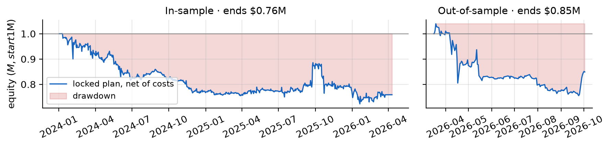

# Whale footprints · biotech options flow, traded before the news

**Idea.** Large, one-directional option trades ("whales") in a biotech name, on a day the news has not
yet covered, predict the stock's move over the next few sessions. We buy the stock after bullish whale
flow and short it after bearish flow, hold 5 sessions, and hedge the biotech beta with XBI.

The hypothesis, its parameters and the locked out-of-sample window were committed before any data was
pulled: see [`docs/HYPOTHESIS.md`](docs/HYPOTHESIS.md) (commit `16e75ab`). Changes made afterwards, all
before any result existed, are in [`docs/DEVIATIONS.md`](docs/DEVIATIONS.md). Every backtest configuration
that was run is logged in [`results/variants_log.csv`](results/variants_log.csv).

The full write-up is the quant note: [`docs/quant_note.pdf`](docs/quant_note.pdf).

## Headline results

Net of costs; reproduced by `run_all.py`. Locked plan = everything in `HYPOTHESIS.md` + `DEVIATIONS.md`:
risk-scaled sizing, XBI hedge, options tail hedge, −15% stop, drawdown de-risking, 20 bps/side, 5% borrow.
In-sample 2024-01-02 → 2026-03-13; out-of-sample 2026-03-16 → 2026-10-02, **run once**
([`results/OOS_LOCK.json`](results/OOS_LOCK.json)).

| | In-sample Sharpe | ann. return | max DD | Out-of-sample Sharpe | ann. return | max DD |
|---|---|---|---|---|---|---|
| **Locked plan** | **−0.56** | −11.5% | −27.8% | **−0.76** | −25.7% | −27.3% |
| Locked plan, ×2 costs | −1.08 | −18.6% | −38.9% | −1.09 | −31.3% | −30.1% |
| No options tail hedge | −0.14 | −4.7% | −22.1% | +0.70 | +18.8% | −15.1% |
| No hedges at all | −0.07 | −3.6% | −20.5% | +1.46 | +50.8% | −13.1% |

The whale signal itself: direction-signed stock move over 5 sessions, traded days, **+1.06% [−0.01, +2.32]
in-sample (n = 593)** and **+2.54% [−0.38, +5.98] out-of-sample (n = 173)**.

The pre-registered plan fails out-of-sample because the options tail hedge costs more than the edge: a median
4.4% of position up front (biotech implied volatility is extreme before catalysts), and a realised 0.85% (IS) /
2.27% (OOS) per hedged trade after resale at exit. The hedge-free variants were declared before the
out-of-sample run, but choosing them after seeing it would be tuning on the test set; they are reported, not
adopted.



## Layout

```
whale_footprints/
├── run_all.py            # entry point: data stages (cached) → backtests → every variant → results/
├── pipeline/
│   ├── config.py         # the locked study configuration (mirrors docs/HYPOTHESIS.md)
│   ├── sources.py        # vendor access + on-disk cache; Databento spend guard
│   ├── budget.py         # persistent Databento spend ledger
│   ├── universe.py       # 1 · biotech list → names with listed options
│   ├── screen.py         # 2 · option-volume spike days
│   ├── whales.py         # 3 · sign whale prints on the OPRA tape
│   ├── signals.py        # 4 · whale days → trade signals, with the news filter
│   ├── backtest.py       # 5 · backtrader on Webull bars
│   ├── hedging.py        #     options tail hedge, priced on real option trades
│   └── analysis.py       # 6 · metrics, factor regression, deflated Sharpe, capacity
├── reporting/
│   ├── note_stats.py     # post-hoc diagnostics quoted in the note → results/note_stats.json
│   └── make_figures.py   # figure pack → figures/
├── docs/                 # HYPOTHESIS.md, DEVIATIONS.md, quant_note.pdf
├── data/                 # committed derived tables (raw vendor cache in data/cache/ is gitignored)
├── results/              # {is,oos}_* metrics, summaries, trades, equity, decay, capacity; OOS lock; variants log
└── figures/
```

## Data, one role per vendor

| Vendor | Used for | Where |
|---|---|---|
| **Massive** | Option reference + daily option bars (the volume screen), stock grouped daily bars (spot, liquidity), **news with per-ticker sentiment** (the "already covered?" filter) | `screen.py`, `signals.py` |
| **Databento** | OPRA `tcbbo`: every option trade with the consolidated best bid/offer at that moment, used to **sign whale prints** (bought vs sold) on flagged days only | `whales.py` (spend-capped, priced before every purchase) |
| **Webull** | Daily stock and XBI bars: **the only prices the backtest trades on** (backtrader) | `backtest.py` |

Raw vendor data is cached under `data/cache/` and never committed. Derived tables (`universe.csv`,
`spike_days.csv`, `whale_days.csv`, `news.csv`, `signals.csv`) are committed, so the backtest can be
reproduced without Databento: Webull keys for the stock bars and a Massive key for the option prices behind
the tail hedge.

## Reproduce

```bash
# from whale_footprints/, Python 3.11+
python -m venv .venv && source .venv/bin/activate     # or: uv venv && uv pip install ...
pip install -r requirements.txt
cp .env.example .env                                  # then fill in your keys

python run_all.py --from-signals          # in-sample, from the committed signals: needs Webull + Massive keys
python run_all.py --from-signals --oos    # the locked out-of-sample run (re-runs only the same spec)

python run_all.py                         # full pipeline (Massive + Databento + Webull); data stages are cached

python reporting/note_stats.py            # diagnostics quoted in the note → results/note_stats.json
python reporting/make_figures.py          # figures/ for the note
```

`run_all.py` refuses to run the out-of-sample window under a different spec than the one recorded in
`results/OOS_LOCK.json` (a hash of `pipeline/config.py`).

Outputs go to `results/`: `{is,oos}_metrics.csv` (baseline and every variant), `{is,oos}_summary.json`
(headline numbers, factor regression, deflated Sharpe, news-status counts, symbols Webull lacks),
`{is,oos}_equity.png`, `{is,oos}_trades.csv`, `{is,oos}_decay.csv`, `{is,oos}_capacity.csv`.

## Pipeline

1. `universe.py`: biotech ticker list → one symbol per company → names with listed options (Massive).
2. `screen.py`: Massive sampled option volume per name → spike days (≥ 2× trailing 20-session median).
3. `whales.py`: stage-1 pool (≥ 1,000 sampled contracts, one-directional call/put volume, liquid), a seeded
   30% sample, Databento `tcbbo` for each day → signed whale premium per threshold.
4. `signals.py`: whale day = 3× spike, ≥ 1,000 contracts on the full tape, ≥ 65% of $50k+ whale premium on
   one side; Massive news from 3 days before through the next open; skip if the news already carried the
   same-direction sentiment.
5. `backtest.py`: backtrader on Webull bars: enter at the next open, exit 5 sessions later; risk-scaled
   sizing with name, liquidity and position caps; −15% stop; drawdown de-risking; daily XBI hedge;
   20 bps per side, 5% annual borrow on shorts.
6. `analysis.py` / `run_all.py`: metrics (return, volatility, Sharpe, max drawdown, turnover, worst month),
   ×2 costs, hedge off, every neighbouring parameter, news-rule variants, the "news already covered"
   shadow book, decay by horizon, XBI/SPY regression, deflated Sharpe, square-root-impact capacity.

## Databento spend

Capped in `pipeline/config.py` (this study ≤ $60 of a $225 budget; ≤ $50 per run). Every request is priced
with `metadata.get_cost` first and recorded in `data/databento_spend_ledger.json`.
